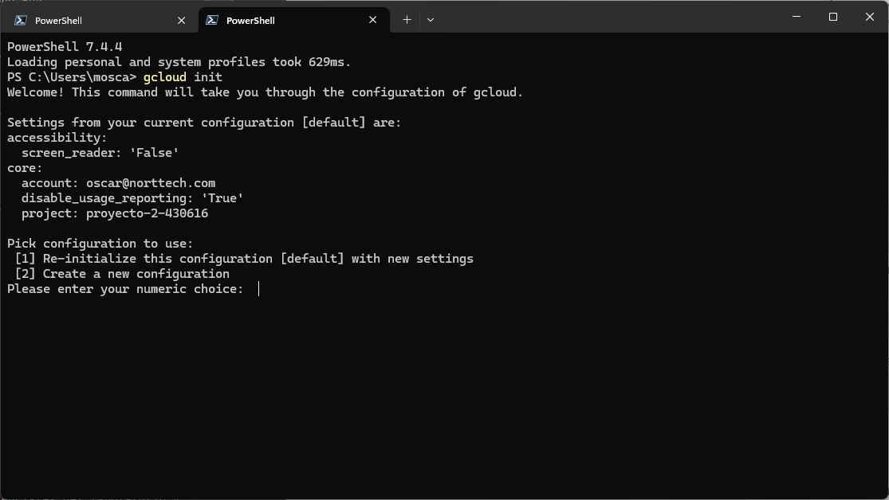
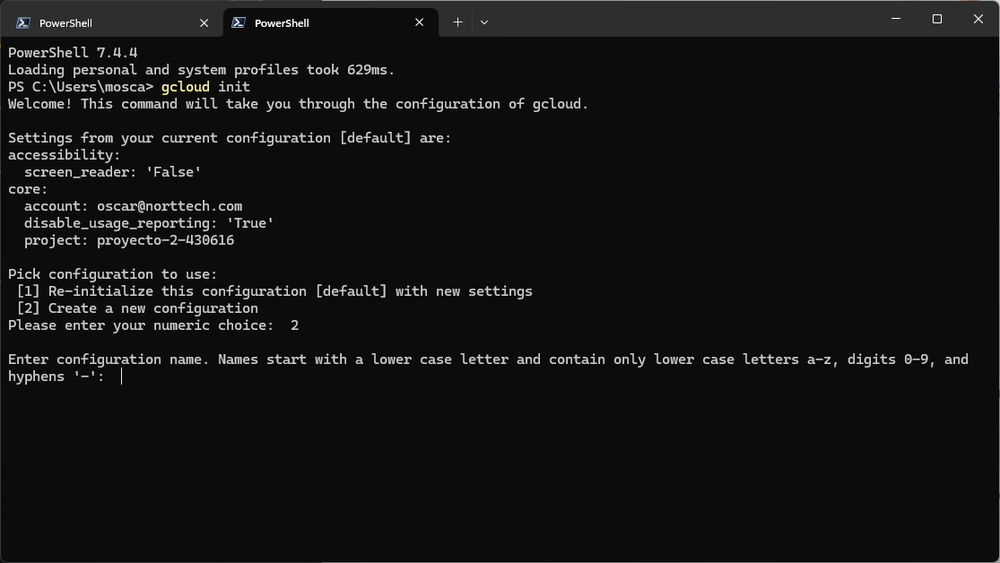
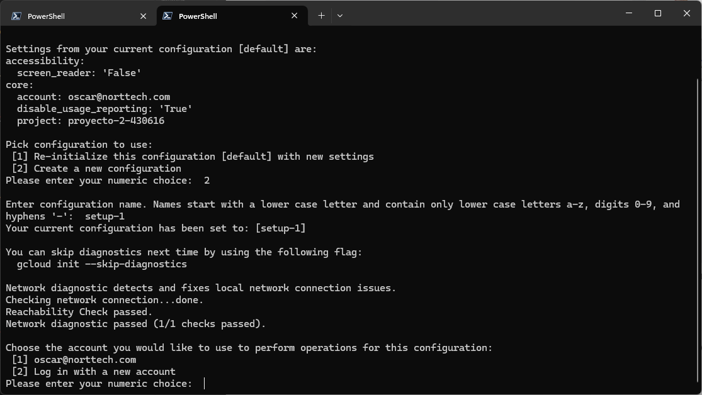
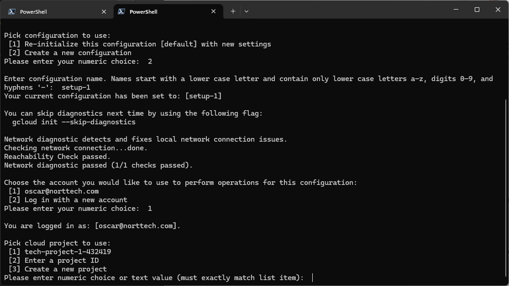
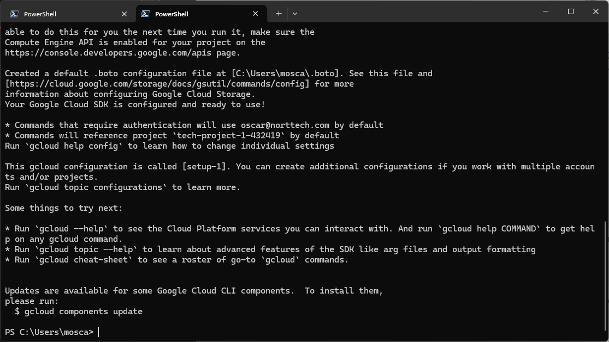
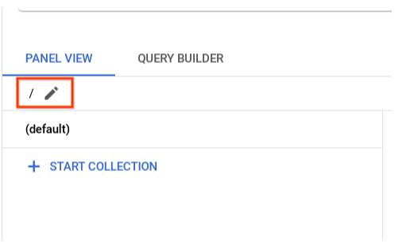
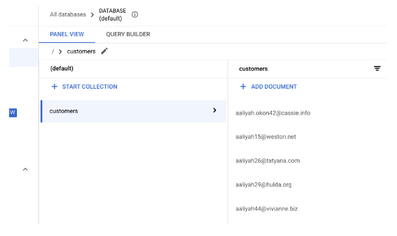

# **Importing Data to a Firestore Database**

Este proyecto guía a los desarrolladores en la configuración de Firestore en Google Cloud y la importación de datos desde un archivo CSV a una base de datos Firestore. Se incluye la generación de datos de prueba y la implementación de logs para monitorizar el proceso.

## **Arquitectura**

Este proyecto utiliza los siguientes componentes y servicios:

- **Firestore**: Base de datos NoSQL de Google Cloud para almacenar los datos importados.
- **Google Cloud Logging**: Servicio para registrar logs de las operaciones realizadas.
- **Node.js**: Entorno de ejecución utilizado para ejecutar los scripts de importación y generación de datos.

## **Objetivos**

    1. Configurar Firestore en Google Cloud.
    2. Escribir código para la importación de bases de datos.
    3. Generar una colección de datos de clientes para pruebas.
    4. Importar los datos de prueba de clientes en Firestore.

## **Requisitos Previos**

    - Cuenta en Google Cloud con acceso a Firestore.
    - Entorno de desarrollo con Node.js instalado.
    - Acceso a Google Cloud Console.
    - SDK instalado.

## **Instrucciones de Instalación**

## Configura tu entorno local

Antes de comenzar con el laboratorio, es necesario que configures tu entorno local con el SDK proporcionado por Google Cloud.

1. Dirígete al siguiente enlace <https://cloud.google.com/sdk/docs/install-sdk?hl=es-419> para descargar el SDK de Google Cloud.

2. Sigue los pasos de instalación según tu sistema operativo:

   

3. Una vez hayas descargado e instalado el SDK de Google Cloud en tu computadora, verifica la instalación. Abre tu terminal y ejecuta el siguiente comando:

   ```bash
   gcloud --version
   ```

4. Verifica que estás autenticado. Ejecuta el siguiente comando en tu terminal:

   ```bash
   gcloud auth login
   ```

   Si se te solicita autenticarte, asegúrate de tener la sesión activa en tu navegador de tu cuenta de Google Console.

   > Puedes iniciar sesión en tu cuenta de Google Console a través del siguiente enlace <https://console.cloud.google.com/?hl=es>

5. Una vez te hayas autenticado, ejecuta el siguiente comando para comenzar con la configuración:

   ```bash
   gcloud init
   ```

6. Al ejecutar el comando, se te pedirá que elijas la configuración deseada (configuración por defecto o crear nueva configuración). Para este laboratorio, selecciona la opción 2: "Crear nueva configuración".

   

7. Al ingresar la opción correspondiente, deberás añadir un nombre para esa configuración (elige un nombre de tu preferencia).

   

8. Luego, selecciona tu cuenta donde iniciaste sesión en Google Console.

   

9. Por último, selecciona el proyecto en el que trabajarás para desarrollar el laboratorio.

   

10. Al terminar la configuración, se debería de obtener un resultado como el siguiente:

    

> Antes de continuar, crea una carpeta en tu escritorio con un nombre de tu elección; ahí es donde trabajarás las tareas del laboratorio

## Configura tu entorno y proyecto

1. Abre la terminal de tu computadora y navega hasta la carpeta que creaste anteriormente.

   Como se trabajará de forma local, la terminal se denominará Cloud Shell. Cloud Shell, por su parte, es la terminal integrada que proporciona Google Console en su interfaz.

2. Para poder utilizar varios servicios de Google Cloud en este laboratorio, debes habilitar algunas API:

   ```bash
   gcloud services enable cloudbuild.googleapis.com cloudfunctions.googleapis.com run.googleapis.com logging.googleapis.com storage-component.googleapis.com aiplatform.googleapis.com
   ```

3. Proporciona credenciales para la aplicación. Ejecuta el siguiente comando en tu terminal:

   ```bash
   gcloud auth application-default login
   ```

   > Este comando abrirá una pestaña del navegador para autenticarte. Asegúrate de tener la sesión activa en tu cuenta de Google Console. 
   
   > Esta autenticación es necesaria para que la aplicación pueda acceder a los servicios de Google Cloud. En este caso se utilizará para acceder a Firestore.

## 1. Configurar Firestore en Google Cloud

- En Google Cloud Console, navega a **Firestore**.
- Haz clic en **+Create Database**.
- Selecciona **Native mode** y la región deseada, luego haz clic en **Create Database**.

Nota: Ambos modos tienen un alto rendimiento con consistencia fuerte, pero se ven diferentes y están optimizados para diferentes casos de uso. El Native Mode es ideal para permitir que muchos usuarios accedan a los mismos datos al mismo tiempo (además, tiene funciones como actualizaciones en tiempo real y conexión directa entre tu base de datos y un cliente web/móvil). El Datastore Mode pone énfasis en un alto rendimiento (muchas lecturas y escrituras).
En el menú desplegable Region, selecciona la región REGION y luego haz clic en Create Database.

## 2. Clonar el Repositorio

Clona el repositorio del proyecto a tu máquina local haciendo uso de la consola y con cd accede a la carpeta:

```bash
git clone https://github.com/rosera/pet-theory
cd pet-theory/lab01
```

En el directorio, puedes ver el archivo package.json. Este archivo enumera los paquetes de los que depende tu proyecto Node.js y hace que tu compilación sea reproducible, por lo tanto, más fácil de compartir con otros.

Un ejemplo de package.json se muestra a continuación:

```bash
{
	"name": "lab01",
	"version": "1.0.0",
	"description": "Este es el lab01 de los laboratorios Pet Theory",
	"main": "index.js",
	"scripts": {
		"test": "echo \"Error: no se especificó ninguna prueba\" && exit 1"
	},
	"keywords": [],
	"author": "Patrick - IT",
	"license": "MIT",
	"dependencies": {
		"csv-parse": "^5.5.3"
	}
}
```

Ejecuta el siguiente comando para instalar las dependencias necesarias:

```bash
npm install @google-cloud/firestore
```

Para habilitar que la aplicación registre logs en Cloud Logging, instala un módulo adicional:

```bash
npm install @google-cloud/logging
```

Después de completar con éxito el comando, el archivo package.json se actualizará automáticamente para incluir las nuevas dependencias, y se verá así:

```bash
"dependencies": {
  "@google-cloud/firestore": "^7.3.0",
  "@google-cloud/logging": "^11.0.0",
  "csv-parse": "^5.5.3"
}

```

Ahora es momento de revisar el script que lee el archivo CSV de clientes y escribe un registro en Firestore por cada línea en el archivo CSV. La aplicación original se muestra a continuación:

```bash
const csv = require('csv-parse');
const fs  = require('fs');

function writeToDatabase(records) {
  records.forEach((record, i) => {
    console.log(`ID: ${record.id} Email: ${record.email} Name: ${record.name} Phone: ${record.phone}`);
  });
  return;
}

async function importCsv(csvFilename) {
  const parser = csv.parse({ columns: true, delimiter: ',' }, async function (err, records) {
    if (e) {
      console.error('Error parsing CSV:', e);
      return;
    }
    try {
      console.log(`Call write to Firestore`);
      await writeToDatabase(records);
      console.log(`Wrote ${records.length} records`);
    } catch (e) {
      console.error(e);
      process.exit(1);
    }
  });

  await fs.createReadStream(csvFilename).pipe(parser);
}

if (process.argv.length < 3) {
  console.error('Please include a path to a csv file');
  process.exit(1);
}

importCsv(process.argv[2]).catch(e => console.error(e));
```

Este código toma la salida del archivo CSV de entrada y la importa a la base de datos heredada. A continuación, actualiza este código para escribir en Firestore.

Abre el archivo

```bash
pet-theory/lab01/importTestData.js.
```

Para referenciar la API de Firestore a través de la aplicación, debes agregar la dependencia al código existente.

Agrega la siguiente dependencia de Firestore en la línea 3 del archivo:

```bash
const { Firestore } = require("@google-cloud/firestore");
```

Asegúrate de que la parte superior del archivo se vea así:

```bash
const csv = require('csv-parse');
const fs  = require('fs');
const { Firestore } = require("@google-cloud/firestore"); // Agregar esto
```

Integrar con la base de datos Firestore se puede lograr con un par de líneas de código.

Agrega el siguiente código debajo de la línea 34, o después de la condicional if (process.argv.length < 3):

```bash
async function writeToFirestore(records) {
  const db = new Firestore({
    // projectId: projectId
  });
  const batch = db.batch()

  records.forEach((record)=>{
    console.log(`Write: ${record}`)
    const docRef = db.collection("customers").doc(record.email);
    batch.set(docRef, record, { merge: true })
  })

  batch.commit()
    .then(() => {
       console.log('Batch executed')
    })
    .catch(err => {
       console.log(`Batch error: ${err}`)
    })
  return
}
```

El fragmento de código anterior declara un nuevo objeto de base de datos, que hace referencia a la base de datos creada anteriormente en el laboratorio. La función utiliza un proceso por lotes en el que cada registro se procesa a su vez y se le asigna una referencia de documento basada en el identificador agregado. Al final de la función, el contenido del lote se compromete (escrito) en la base de datos.

Actualiza la función importCsv para agregar la llamada a la función writeToFirestore y eliminar la llamada a writeToDatabase. Debería verse así:

```bash
async function importCsv(csvFilename) {
    const parser = csv.parse({ columns: true, delimiter: ',' }, async function (err, records) {
        if (err) {
            console.error('Error parsing CSV:', err);
            return;
        }
        try {
            console.log(`Call write to Firestore`);
            await writeToFirestore(records);
            // await writeToDatabase(records);
            console.log(`Wrote ${records.length} records`);
        } catch (e) {
            console.error(e);
            process.exit(1);
        }
    });
    await fs.createReadStream(csvFilename).pipe(parser);
}
```

Agrega registro de logs para la aplicación. Para referenciar la API de Logging a través de la aplicación, agrega la dependencia al código existente. 

Agrega la siguiente línea justo debajo de las otras declaraciones require en la parte superior del archivo: 
    
```bash
const { Logging } = require('@google-cloud/logging');
```
Asegúrate de que la parte superior del archivo se vea así:
    
```bash
const csv = require('csv-parse');
const fs  = require('fs');
const { Firestore } = require("@google-cloud/firestore");
const { Logging } = require('@google-cloud/logging');
```

Agrega algunas variables constantes e inicializa el cliente de Logging. 

Agrégalas justo debajo de las líneas anteriores en el archivo (~línea 5), así:
    
```bash
const logName = "pet-theory-logs-importTestData";

// Crea un cliente de Logging
const logging = new Logging();
const log = logging.log(logName);

const resource = {
  type: "global",
};
```

Agrega código para registrar los logs en la función importCsv justo debajo de la línea console.log(Wrote ${records.length} records); que debería verse así:
    
```bash
// Una entrada de log de texto
success_message = `Success: importTestData - Wrote ${records.length} records`;
const entry = log.entry(
	{ resource: resource },
	{ message: `${success_message}` }
);
log.write([entry]);
```

Después de estas actualizaciones, tu bloque de código de la función importCsv debería verse como el siguiente:

```bash
async function importCsv(csvFilename) {
  const parser = csv.parse({ columns: true, delimiter: ',' }, async function (err, records) {
    if (err) {
      console.error('Error parsing CSV:', err);
      return;
    }
    try {
      console.log(`Call write to Firestore`);
      await writeToFirestore(records);
      // await writeToDatabase(records);
      console.log(`Wrote ${records.length} records`);
      // Una entrada de log de texto
      success_message = `Success: importTestData - Wrote ${records.length} records`;
      const entry = log.entry(
	     { resource: resource },
	     { message: `${success_message}` }
      );
      log.write([entry]);
    } catch (e) {
      console.error(e);
      process.exit(1);
    }
  });

  await fs.createReadStream(csvFilename).pipe(parser);
}
```

Ahora, cuando el código de la aplicación esté en ejecución, la base de datos de Firestore se actualizará con el contenido del archivo CSV. La función importCsv toma un nombre de archivo y analiza el contenido línea por línea. Cada línea procesada ahora se envía a la función de Firestore writeToFirestore, donde cada nuevo registro se escribe en la base de datos "customer".

## 3. Crear datos de prueba

Primero, instala la librería "faker", que será utilizada por el script que genera los datos falsos de clientes. 

Ejecuta el siguiente comando para actualizar la dependencia en package.json: 
    
```bash
npm install faker@5.5.3
```

Ahora abre el archivo createTestData.js con el editor de código y revisa el código. Asegúrate de que se vea como el siguiente:
    
```bash
const fs = require('fs');
const faker = require('faker');

function getRandomCustomerEmail(firstName, lastName) {
  const provider = faker.internet.domainName();
  const email = faker.internet.email(firstName, lastName, provider);
  return email.toLowerCase();
}

async function createTestData(recordCount) {
  const fileName = `customers_${recordCount}.csv`;
  var f = fs.createWriteStream(fileName);
  f.write('id,name,email,phone\n')
  for (let i=0; i<recordCount; i++) {
    const id = faker.datatype.number();
    const firstName = faker.name.firstName();
    const lastName = faker.name.lastName();
    const name = `${firstName} ${lastName}`;
    const email = getRandomCustomerEmail(firstName, lastName);
    const phone = faker.phone.phoneNumber();
    f.write(`${id},${name},${email},${phone}\n`);
  }
  console.log(`Created file ${fileName} containing ${recordCount} records.`);
}

recordCount = parseInt(process.argv[2]);
if (process.argv.length != 3 || recordCount < 1 || isNaN(recordCount)) {
  console.error('Include the number of test data records to create. Example:');
  console.error('    node createTestData.js 100');
  process.exit(1);
}

createTestData(recordCount);
```

Agrega Logging para la base de código. En la línea 3, agrega la siguiente referencia para el módulo de la API de Logging desde el código de la aplicación: 

```bash
const { Logging } = require("@google-cloud/logging");
```
La parte superior del archivo ahora debería verse así:
    
```bash
const fs = require("fs");
const faker = require("faker");
const { Logging } = require("@google-cloud/logging"); //agregar esto
```

Ahora, agrega algunas variables constantes e inicializa el cliente de Logging. 

Agrégalas justo debajo de las declaraciones const:
    
```bash
const logName = "pet-theory-logs-createTestData";

// Crea un cliente de Logging
const logging = new Logging();
const log = logging.log(logName);

const resource = {
	// Este ejemplo apunta al recurso "global" por simplicidad
	type: "global",
};
```

Agrega código para registrar los logs en la función createTestData justo debajo de la línea:

```bash
console.log(Created file ${fileName} containing ${recordCount} records.);
```

Se verá así:
    
```bash
// Una entrada de log de texto
const success_message = `Success: createTestData - Created file ${fileName} containing ${recordCount} records.`;
const entry = log.entry(
	{ resource: resource },
	{
		name: `${fileName}`,
		recordCount: `${recordCount}`,
		message: `${success_message}`,
	}
);
log.write([entry]);
```

Después de actualizar, el bloque de código de la función createTestData debería verse así:
    
```bash
async function createTestData(recordCount) {
  const fileName = `customers_${recordCount}.csv`;
  var f = fs.createWriteStream(fileName);
  f.write('id,name,email,phone\n')
  for (let i=0; i<recordCount; i++) {
    const id = faker.datatype.number();
    const firstName = faker.name.firstName();
    const lastName = faker.name.lastName();
    const name = `${firstName} ${lastName}`;
    const email = getRandomCustomerEmail(firstName, lastName);
    const phone = faker.phone.phoneNumber();
    f.write(`${id},${name},${email},${phone}\n`);
  }
  console.log(`Created file ${fileName} containing ${recordCount} records.`);
  // Una entrada de log de texto
  const success_message = `Success: createTestData - Created file ${fileName} containing ${recordCount} records.`;
  const entry = log.entry(
	  { resource: resource },
	  {
	  	name: `${fileName}`,
	  	recordCount: `${recordCount}`,
	  	message: `${success_message}`,
	  }
  );
  log.write([entry]);
}
```

Ejecuta el siguiente comando en Cloud Shell para crear el archivo customers_1000.csv, que contendrá 1000 registros de datos de prueba:
    
```bash
node createTestData 1000
```

Deberías recibir una salida en la consola similar a:
        
```bash
Created file customers_1000.csv containing 1000 records.
```

Abre el archivo customers_1000.csv y verifica que los datos de prueba se hayan creado correctamente.

## 4. Importar datos de prueba en Firestore

Para probar la capacidad de importación, utiliza tanto el script de importación como los datos de prueba creados anteriormente: 
    
```bash
node importTestData customers_1000.csv
```

Deberías recibir una salida similar a la siguiente:
        
```bash
Writing record 500
Writing record 1000
Wrote 1000 records
```

Si recibes un error similar al siguiente: 
        
```bash
Error: Cannot find module 'csv-parse'
```

Ejecuta el siguiente comando para agregar el paquete csv-parse a tu entorno:
        
```bash
npm install csv-parse
```
Luego, ejecuta el comando nuevamente. Deberías recibir la siguiente salida:

```bash
Writing record 500
Writing record 1000
Wrote 1000 records
```

## 5. Inspeccionar los datos en Firestore

¡Abre Firestore y ve los resultados!

Regresa a tu pestaña de Cloud Console. En el menú de Navegación, haz clic en Firestore. Una vez allí, haz clic en el ícono del lápiz.



Escribe /customers y presiona Enter.

Actualiza la pestaña de tu navegador y deberías ver la siguiente lista de clientes migrados con éxito:

 
